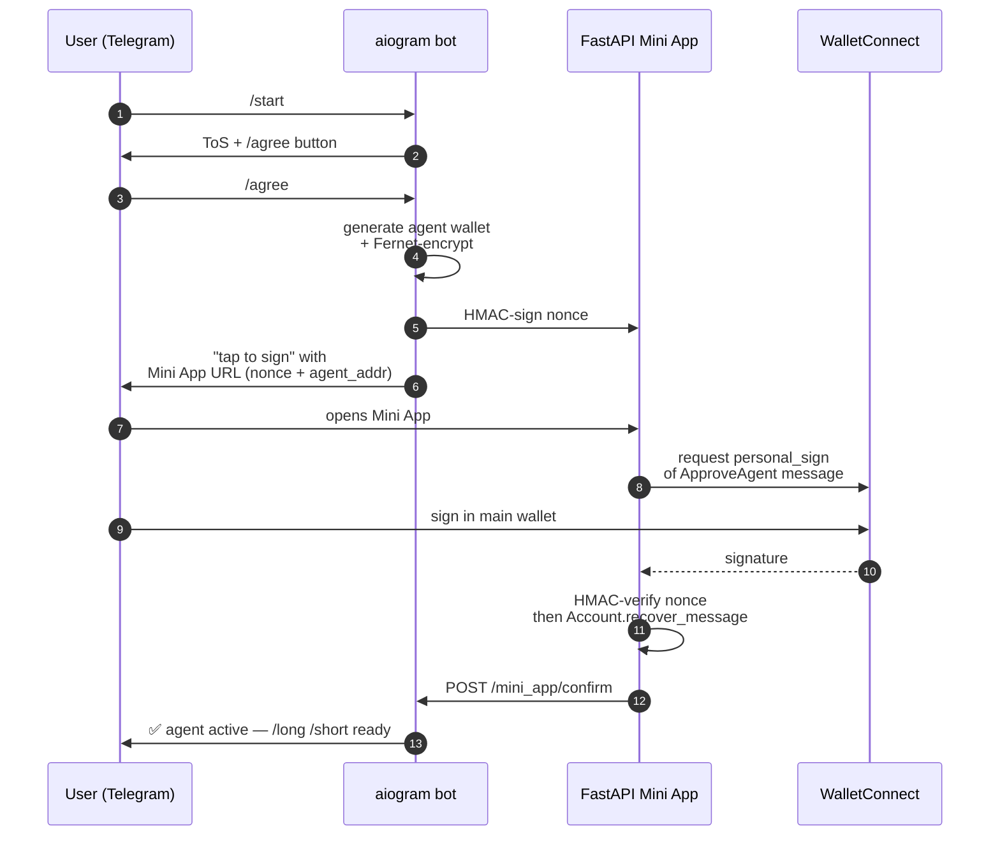

# hypekr-bot

Korean-first Telegram bot for **Hyperliquid perps/spot/HIP-4 event contracts**.
aiogram 3 + FastAPI Mini App + per-user Fernet-encrypted agent wallets.
Revenue via builder-fee at 5 bps.

## Custody model

| Option | Custody | VASP risk (KR) | Used here? |
|---|---|---|---|
| A. External sign via Mini App | user holds everything | none | used for onboarding (ApproveAgent) |
| B. Agent wallet | bot holds a key that can't withdraw | defensible as not-a-VASP | **primary model** |
| C. Bot-managed main wallet | bot holds main key | crosses VASP line | **never** |

The user signs exactly one `ApproveAgent` message in their main wallet via
WalletConnect in the Mini App. From that moment, the bot's agent key for
that user can place orders but cannot withdraw funds.

## Encryption

Two-layer Fernet envelope. Pseudocode:

```python
# per-user inner key derived from master + user_id via HKDF-like SHA256
inner_key = b64(hmac_sha256(master, b"hypekr/agent-wallet/v1" + user_id))
inner_ct = Fernet(inner_key).encrypt(private_key)
outer_ct = Fernet(master).encrypt(inner_ct)
# store outer_ct; plaintext key is zeroed on scope exit
```

Master-key rotation re-wraps *all* wallets by decrypting the outer layer only
— the inner ciphertexts stay fixed. No user needs to re-sign.

## Onboarding flow



The nonce is HMAC-signed with `HYPEKR_APP_SIGNING_SECRET` so a spoofed
front-end can't mint approvals; then the payload is cryptographically verified
via `eth_account.Account.recover_message` before activation.

## Builder-fee order construction

All orders are pure-functional structures built in
`apps/hypekr-bot/src/hypekr_bot/hl/builder.py`:

```python
build_ioc_order(
    coin="BTC", is_buy=True, sz=0.1,
    best_price=100_000.0,
    slippage_bps=50,                              # ±0.5%
    builder=BuilderFeeConfig.from_settings(),     # 5 bps → 50 tenths
)
```

Paper trading (`PAPER_TRADING=true`, default) short-circuits every network
call and logs the intended order. Live orders require explicit
`PAPER_TRADING=false` + a valid agent wallet.

## Korean + English command aliases

Every handler accepts both languages via aiogram's `Command(commands=[en, kr])`:

| English | 한국어 |
|---|---|
| `/start` | — |
| `/agree` | `/동의` |
| `/status` | `/상태` |
| `/long` | `/롱` |
| `/short` | `/숏` |
| `/close` | `/청산` |
| `/positions` | `/포지션` |
| `/balance` | `/잔고` |
| `/yes` | `/예` |
| `/no` | `/아니오` |
| `/predict` | `/예측` |

## Regulatory discipline

- No KRW rail. Adding one crosses the VASP line (VAUPA in force since
  July 2024).
- No KakaoTalk-native trading bot — Kakao ToS explicitly bars unregulated
  financial services from channels.
- Korean ToS + PIPA privacy policy drafted via Lawform (~₩50-150K) +
  attorney review (₩1-3M budget) before any paid marketing.
- Every handler message is idempotent — double-tap doesn't double-trade.

## Where this lives

- [`apps/hypekr-bot/`](https://github.com/ksk5429/kfish/tree/main/apps/hypekr-bot)
  (private repo)
- Deploy target: [Fly.io NRT (Tokyo)](https://fly.io/apps/hypekr-bot) — ~30 ms
  edge latency to Seoul
- Runbook: `runbooks/deploy.md` in the private repo
