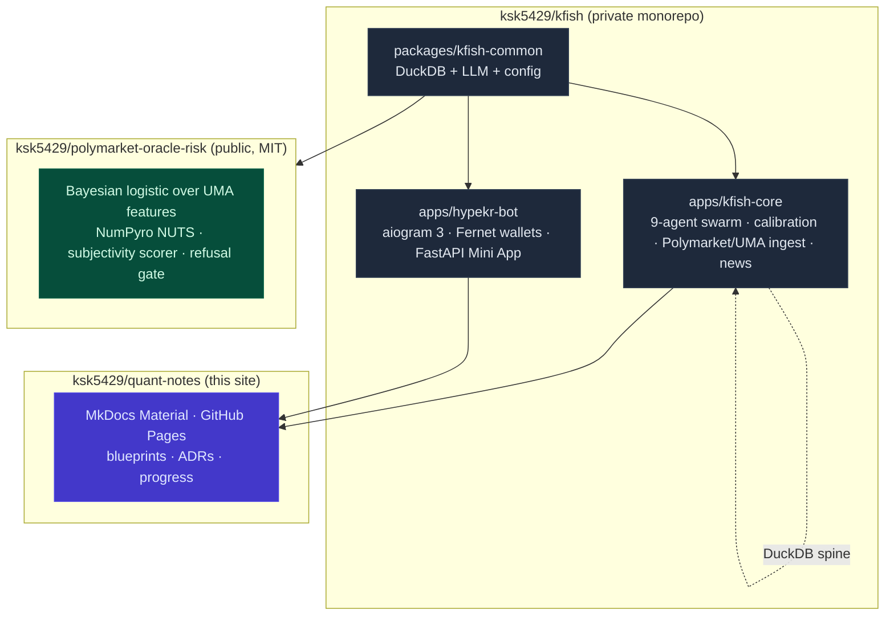
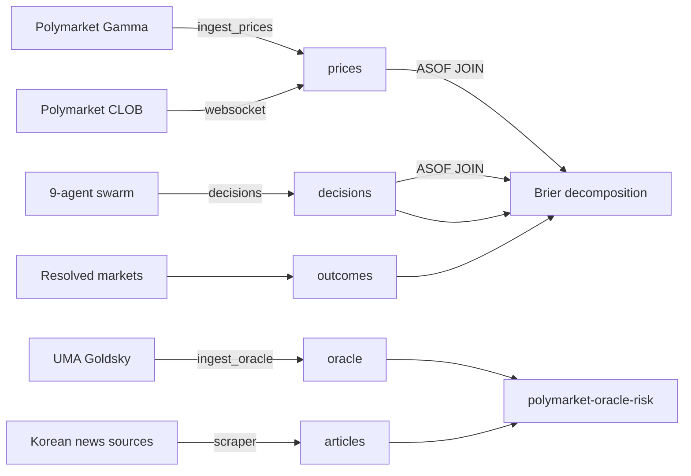

# Architecture overview

## The three packages at a glance



## Why a hybrid (monorepo + polyrepo)

GitHub's visibility is per-repo, not per-directory. Mixing production alpha
with a public PyPI package in a single repo forces a choice between leaking
alpha and skipping the publishable artifact. The blueprint resolves this with:

- one **private uv-workspace monorepo** (`kfish`) for everything that must not
  leak — the 9-persona prompts, calibration bundles, Telegram bot;
- one **standalone public repo** (`polymarket-oracle-risk`) for the analyzer;
- this **docs site** (`quant-notes`) for non-alpha context and review.

See [ADR-0001](adrs.md#adr-0001) for the full analysis.

## The DuckDB calibration spine

The single highest-leverage piece is a DuckDB warehouse where every forecast,
market price, oracle event, news article, and outcome shares a UTC timeline
joined via `ASOF JOIN`.



Everything downstream — the refusal gate, the shrinkage ensemble, the
retrodiction pipeline, the nightly Parquet snapshot — reads or writes one
file: `data/warehouse/kfish.duckdb`.

## The 9 personas

Schoenegger et al. 2024 showed that **structural reasoning diversity beats
model diversity** in LLM forecasting ensembles. K-Fish runs nine orthogonal
personas, one of which (`red_team`) routes to the opposite provider:

1. `contrarian`
2. `inside_view`
3. `outside_view`
4. `premortem`
5. `devils_advocate`
6. `quant`
7. `geopolitical`
8. `macro`
9. `red_team` — always on the opposite provider to the ensemble

Per-persona samples aggregate via median (default) or trimmed-mean, then go
through asymmetric extremization that pushes confident consensus outward but
shrinks dispersed consensus toward 0.5.

## The calibration stack

Raw LLM probabilities are never used directly. The pipeline is:

```text
raw_prob (9 personas, Delphi'd)
  → isotonic per category       (low-bias, needs n >= 150)
  → Venn-Abers                  (distribution-free intervals)
  → Mondrian conformal gate     (skip if prediction set = {0, 1})
  → shrinkage ensemble          (α · p_llm + (1 - α) · p_market, α EB-shrunk)
  → final probability
```

See [ADR-0008](adrs.md#adr-0008) and the
[calibration deep-dive](swarm-calibration.md).

## Oracle risk (public package)

The public analyzer is a **Bayesian logistic** over UMA resolution features:

- Priors: β ~ Normal(0, 1), α ~ Normal(-3, 2) (base rate ≈ 2%)
- Posterior via NumPyro NUTS
- Subjectivity scored by a Claude/GPT rubric with a **Zelenskyy regression
  test** that must always score ≥ 0.75
- Refusal gate hard-refuses markets with `mean > 0.35` *or* 95% CI width > 0.50

The gate folds back into K-Fish's `kfish-core` as a pre-trade filter.
