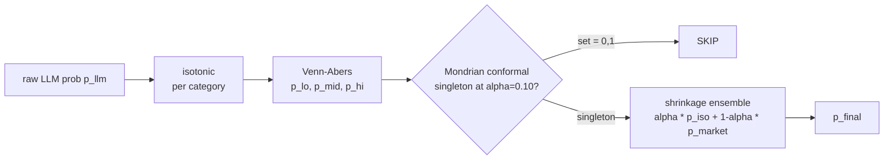

# Calibration Stack

Raw LLM probabilities are never traded against directly. Project Rule R4
([CLAUDE.md](https://github.com/ksk5429/kfish/blob/main/CLAUDE.md)) is explicit:

> R4 — Calibration is Mandatory. Raw LLM probabilities never used directly; all
> go through the calibration pipeline.

The stack stacks four post-hoc methods into a single
[`CalibratorBundle`](https://github.com/ksk5429/kfish/blob/main/apps/kfish-core/src/kfish_core/calibration/refit.py),
each compensating for a different defect of the prior stage. The design follows
[ADR-0008](https://github.com/ksk5429/kfish/blob/main/docs/decisions/0008-isotonic-venn-abers-calibration.md).

## Why not trust the LLM probability

Two reasons:

1. **Systematic miscalibration.** [Tian et al. 2023] measured Claude, GPT, and
   Llama on multi-choice QA and found persistent overconfidence at the tails
   (p ≥ 0.8 and p ≤ 0.2) and reversion-to-0.5 bias at the center.
2. **No distribution-free guarantee.** The LLM can be wrong about its own
   uncertainty and there is no native way to express "I am $(1-\alpha)$
   confident my probability is in $[p_\text{lo}, p_\text{hi}]$."

Post-hoc calibration fixes both at decision time without retraining the model.

## Pipeline



## Isotonic regression

Fits a monotone non-decreasing function $g: [0, 1] \to [0, 1]$ by minimizing
squared error under an order constraint, solved with the Pool Adjacent
Violators (PAV) algorithm [Barlow et al. 1972]:

$$
g^* = \arg\min_{g \text{ isotonic}} \sum_i (g(p_i) - y_i)^2.
$$

Isotonic is low-bias but high-variance; [Niculescu-Mizil & Caruana 2005]
recommend $\ge 500$ calibration points. We set the per-category guard lower
($\ge 150$) and degrade gracefully to the identity map when below threshold.
See
[`IsotonicCalibrator`](https://github.com/ksk5429/kfish/blob/main/apps/kfish-core/src/kfish_core/calibration/isotonic.py).

!!! note "Why per-category"
    Calibration drifts by category — "elections" miscalibrate differently from
    "crypto prices". Fitting globally averages away the effect we want to
    correct.

## Venn-Abers predictors

[Vovk et al. 2015] Venn-Abers produce an **interval** $[p_0, p_1]$ that
contains the true posterior probability with asymptotic validity under the
exchangeability assumption. Unlike a confidence interval on a point estimate,
the VA interval has a distribution-free finite-sample guarantee: the average
of $p_0$ over the calibration sequence equals the empirical frequency
conditional on the model's ordering.

We use Inductive Venn-Abers (IVAP) via the `venn-abers` package. Our wrapper
[`VennAbersCalibrator`](https://github.com/ksk5429/kfish/blob/main/apps/kfish-core/src/kfish_core/calibration/venn_abers.py)
returns $(p_\text{lo}, p_\text{mid}, p_\text{hi})$ with the midpoint used as a
point estimate and the width $p_\text{hi} - p_\text{lo}$ as an uncertainty
signal for position sizing downstream.

## Mondrian conformal prediction

Plain conformal prediction gives marginal $(1-\alpha)$ coverage. Mondrian
conformal [Vovk et al. 2003] stratifies the calibration set by a **taxonomy**
and gives conditional coverage per stratum. Our stratification is
`(category, true_class)`:

$$
\Pr\bigl(Y \in \hat{C}(X) \mid \text{cat}(X) = c,\, Y = y\bigr) \ge 1 - \alpha.
$$

This is strictly stronger than the more common `category`-only Mondrian. Without
the `true_class` axis, a category whose base rate is 80% could have 100%
coverage for the majority class and near-zero for the minority while still
appearing "calibrated" on average.

Nonconformity score for calibration point $(p, y)$:

$$
s(p, y) = 1 - p_\text{true}, \qquad p_\text{true} = \begin{cases} p & \text{if } y = 1 \\ 1 - p & \text{if } y = 0 \end{cases}.
$$

At decision time:

| Prediction set | Meaning | Action |
|---|---|---|
| $\{1\}$ | Only class 1 plausible at $\alpha$ | trade YES |
| $\{0\}$ | Only class 0 plausible | trade NO |
| $\{0, 1\}$ | Both plausible, or too little data | **skip** |

Default $\alpha = 0.10$ with $\ge 30$ samples per (category, class). See
[`MondrianConformalFilter`](https://github.com/ksk5429/kfish/blob/main/apps/kfish-core/src/kfish_core/calibration/conformal.py).

## Empirical-Bayes shrinkage ensemble

After the calibrated probability $p_\text{llm}$, we combine with the market
price:

$$
p_\text{final} = \alpha_c \cdot p_\text{llm} + (1 - \alpha_c) \cdot p_\text{market}.
$$

The per-category weight $\alpha_c$ is fit by line-search to minimize log-loss
on historical decisions, then **shrunk** toward a global $\alpha$ by empirical
Bayes [Efron 2010]:

$$
\alpha_c^{\text{shrunk}} \;=\; w_c \,\alpha_c^{\text{raw}} + (1 - w_c)\, \alpha_{\text{global}},
\qquad w_c = \frac{n_c}{n_c + k}, \quad k = 50.
$$

A category with few trades inherits the global weight; one with many decisions
earns its own estimate. Implementation:
[`ShrinkageEnsemble`](https://github.com/ksk5429/kfish/blob/main/apps/kfish-core/src/kfish_core/calibration/ensemble.py).

!!! tip "Low alpha is a signal, not a bug"
    If $\alpha_c \to 0$ for a category (market dominates the combination), the
    LLM has no edge there. If $\alpha_c \to 1$ on a liquid market, that niche
    is inefficient — exactly where we want to concentrate effort.

## CalibratorBundle: atomic hot-swap

All four fitted objects are pickled together in a
[`CalibratorBundle`](https://github.com/ksk5429/kfish/blob/main/apps/kfish-core/src/kfish_core/calibration/refit.py).
Save is atomic via `tempfile.NamedTemporaryFile` $\to$ `Path.replace`:

```python
with tempfile.NamedTemporaryFile("wb", dir=target.parent, delete=False) as fh:
    pickle.dump(self, fh, protocol=pickle.HIGHEST_PROTOCOL)
    tmp_path = Path(fh.name)
tmp_path.replace(target)  # atomic on POSIX
```

The trading loop reloads the bundle at startup; a mid-flight swap leaves no
half-written file. Library versions (`scikit-learn`, `venn-abers`, `numpy`,
`scipy`) are snapshot at save time — a silent `pip install --upgrade
scikit-learn` that subtly changes `IsotonicRegression` internals is logged as
`CalibratorBundle library drift detected` on next load.

## When to refit

`refit_calibrators`
([`refit.py`](https://github.com/ksk5429/kfish/blob/main/apps/kfish-core/src/kfish_core/calibration/refit.py))
pulls the last 2000 labelled decisions, retrains every component, and swaps
the bundle. Triggers:

| Trigger | Cadence | Why |
|---|---|---|
| Scheduled | Nightly, part of [pipeline/nightly.py](https://github.com/ksk5429/kfish/blob/main/apps/kfish-core/src/kfish_core/pipeline/nightly.py) | Calibration drifts with regime |
| Per-category threshold | Every 50 new resolved trades in a category | Fresh data for a hot niche |
| Library drift | On load-time warning | sklearn / venn-abers version change |
| Manual | `uv run kfish-calibrate` after protocol change | Model prompt edits, new persona, etc. |

!!! warning "Too-frequent refits are a hazard"
    Refit with too little new data and isotonic overfits the last batch; the
    bundle starts tracking noise. The 2000-row window and the 50-trade
    per-category guard keep the signal-to-noise sane.

## References

- Barlow RE, Bartholomew DJ, Bremner JM, Brunk HD (1972). *Statistical inference under order restrictions.* Wiley.
- Efron B (2010). *Large-scale inference.* Cambridge University Press.
- Niculescu-Mizil A, Caruana R (2005). *Predicting good probabilities with supervised learning.* ICML.
- Tian K, Mitchell E, Zhou A, et al. (2023). *Just ask for calibration.* EMNLP.
- Vovk V, Lindsay D, Nouretdinov I, Gammerman A (2003). *Mondrian confidence machine.* On-line Compression Modelling Project.
- Vovk V, Petej I, Fedorova V (2015). *Large-scale probabilistic predictors with and without guarantees of validity.* NeurIPS.
- [ADR-0008: Isotonic + Venn-Abers + Mondrian conformal](https://github.com/ksk5429/kfish/blob/main/docs/decisions/0008-isotonic-venn-abers-calibration.md).
