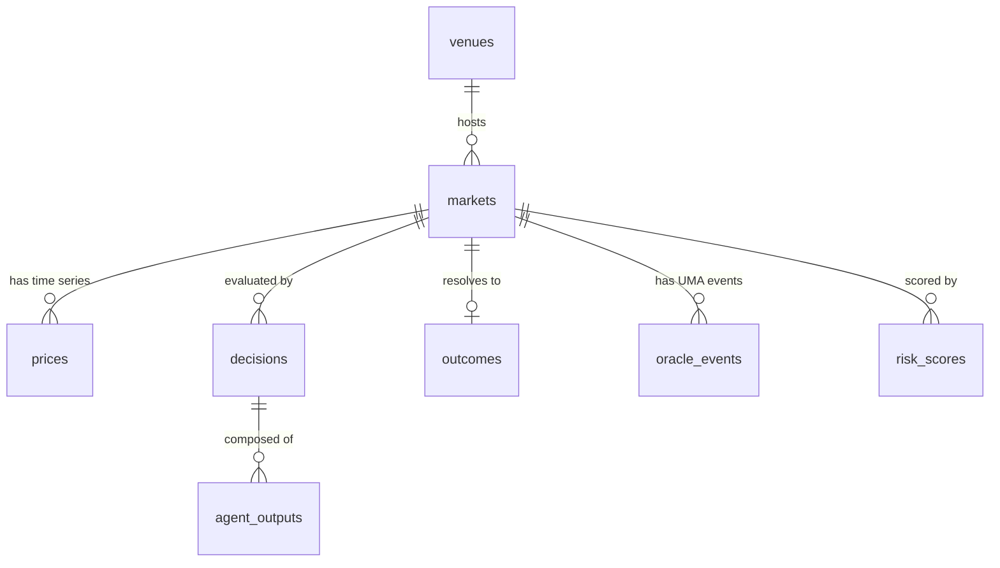

# Data model

K-Fish uses **DuckDB** as the single source of truth. Every forecast, price,
news item, and oracle event joins on the same UTC timeline. ADR-0002
rationalizes the choice.

!!! note "One file, one schema"
    The warehouse is a single DuckDB file at `data/warehouse/kfish.duckdb`.
    The DuckDB schema `kfish` holds every domain table; `main` stays empty
    so imports/exports don't collide with the application namespace.

## Core tables



### `kfish.venues`

Registry of trading venues. Seeded with `polymarket`, `kalshi`,
`hyperliquid`. Columns: `venue_id` (PK), `display_name`, `base_url`,
`fee_bps`, `created_at`.

### `kfish.markets`

One row per market, uniquely keyed by `(venue_id, native_id)`. Carries
`question`, `category`, `opened_at`, `closes_at`, `resolved_at`,
`resolution_value`, and a `meta JSON` blob for venue-specific fields.

### `kfish.prices`

Time series of `(market_id, ts, outcome, price)`. Indexed on
`(market_id, ts)` for range scans and ASOF joins. Also carries
`best_bid`/`best_ask`/`volume_24h`/`liquidity` when Gamma exposes them.

### `kfish.decisions`

One row per *swarm output* for a given market at a given timestamp:

| Column | Meaning |
|---|---|
| `decision_id` | UUID, PK |
| `market_id`, `ts` | Forecast point |
| `horizon_hours` | Time to resolution at `ts` |
| `ensemble_prob` | Calibrated YES probability |
| `ensemble_method` | e.g. `"median+extremize"` or `"venn_abers"` |
| `ensemble_conf` | Aggregator-reported confidence |
| `market_price_at_ts` | Observed Polymarket mid |
| `edge_bps` | `10000 * (ensemble_prob − market_price_at_ts)` |
| `kelly_frac` | Sized position fraction |
| `traded` | Whether it was actually routed |
| `trade_size_usd` | Actual USDC sent |
| `prompt_version`, `git_sha` | Reproducibility tags |

### `kfish.agent_outputs`

Per-persona reasoning that built a decision. `PRIMARY KEY (decision_id,
agent_name)`. Stores the full `reasoning` text, tokens in/out, cost,
latency, Langfuse trace ID, and exact model string.

### `kfish.outcomes`

Final ground truth: `market_id` (PK), `resolved_at`, `outcome ∈ {0, 1}`,
`pnl_if_held`. This is what retrodiction, calibration, and the Brier
decomposition join against.

### `kfish.articles`

Korean news corpus. `article_id UUID`, `url UNIQUE`, `title_ko`/`title_en`,
`body_ko`/`body_en`, `body_ko_tokens` (Kiwi-tokenized for FTS),
`published_at`, `simhash BIGINT`, `embedding FLOAT[1024]`, `meta JSON`.
Full-text search is built lazily via `fts.ensure_article_fts()`; see
[News Pipeline](news.md).

### `kfish.oracle_events` and `kfish.risk_scores`

UMA Optimistic Oracle state changes and the Bayesian risk scorer's
per-market posteriors. `event_type ∈ {ProposePrice, DisputePrice, Settle,
Reset}`.

### `kfish.calibration_rows` (view)

```sql
SELECT d.decision_id, d.ts, d.ensemble_prob, o.outcome
  FROM kfish.decisions d
  JOIN kfish.outcomes  o USING (market_id)
 WHERE o.outcome IS NOT NULL;
```

The Brier decomposer (`decompose_brier_sql`) reads this view.

## ASOF joins

Every `(market, timestamp)` in `decisions` and `agent_outputs` needs the
*most recent* `prices` row at-or-before that timestamp. Standard `JOIN …
USING (market_id) WHERE ts <= d.ts` is O(n²). DuckDB's `ASOF JOIN` is
O(n log n):

```sql
SELECT d.*, p.price AS market_price
  FROM kfish.decisions d
  ASOF LEFT JOIN kfish.prices p
    ON d.market_id = p.market_id
   AND d.ts        >= p.ts;
```

The helper `asof_market_price(market_id, ts)` in
`packages/kfish-common/src/kfish_common/db/asof.py` wraps this pattern
with a bounded stale-tolerance window.

## Migrations

Flyway-style numbered files in `migrations/`:

```
V0001__init.sql              venues, markets, prices, decisions, agent_outputs, outcomes
V0002__add_articles_fts.sql  kfish.articles (FTS index built lazily)
V0003__add_oracle_events.sql oracle_events, risk_scores, calibration_rows view
```

Applied via `uv run kfish-migrate`. State is tracked in
`kfish.schema_history`. **Migrations are idempotent:** re-running against
an already-migrated database is a no-op.

!!! warning "Never edit an applied migration"
    Rule from ADR-0002. If you need to fix a shipped migration, add
    `V000N+1__fix_…sql`. The `UNIQUE(version)` constraint in
    `schema_history` will reject a re-applied file with modified
    contents.

## Timezone discipline

Every timestamp column is `TIMESTAMPTZ`. All application code writes UTC.
The systemd `kfish-nightly.service` pins `Environment=TZ=UTC` to avoid
KST↔UTC boundary artifacts (see [Validation](validation.md) §cutover).

## Related

- Schema files: `migrations/V000*.sql`
- DuckDB client: `packages/kfish-common/src/kfish_common/db/`
- ADR-0002: DuckDB + ASOF + Parquet interop
